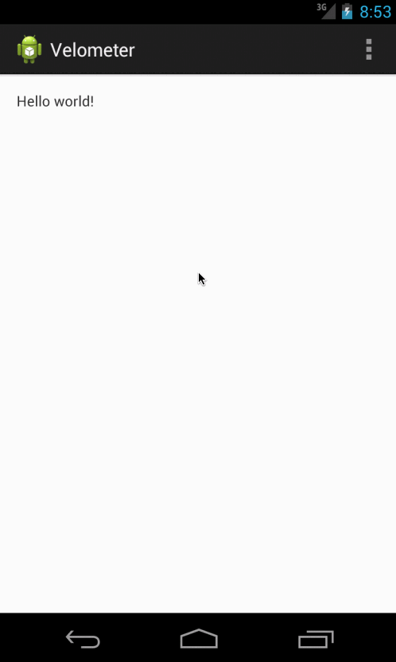

# Velometer
*A UI control that simulates velometer on Android*

## Why?
In our app, we kind of need user to hold on a button to send some data. Please don't ask me why I didn't use a switch button or something, it's just a decision. While the user holds his finger down, we want to change some config, for example, imagine this button as the accelerator of a car, and we didnot want the user take the other hand to change the gear, so we need some control that can change it's value while user keeps his finger on screen. That's the situation our Velomter designed to solve.

## Screenshots

## Installation
To be written later.

## Development Status
Due to the deadline is near, this is a quick and dirty implementation. There are so many constants and magic number which should be taken out from code, and can be configured through XML files. 

